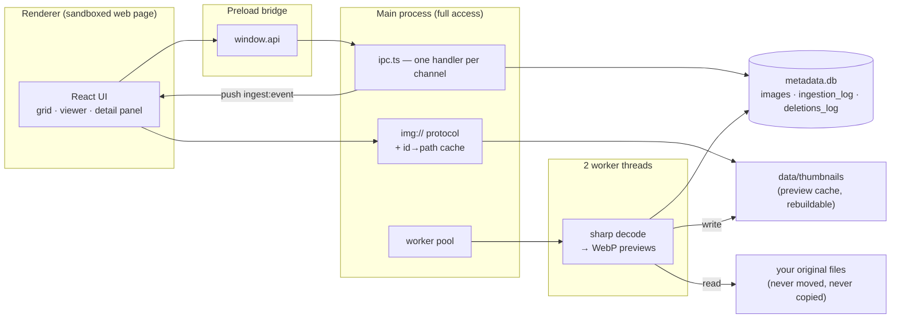
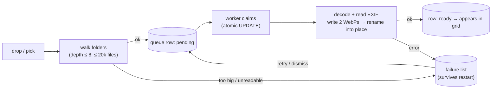
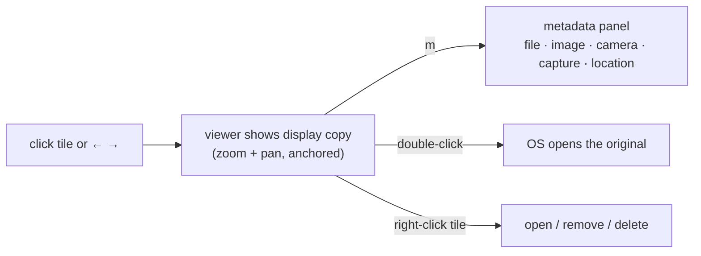

# Image Library & Display

A desktop app (Electron + React) for looking at a folder-load of photos — including big TIF
survey images that browsers can't open. It **never copies or moves your originals**. It just
remembers where they are, makes small fast preview copies, and gives you a clean two-pane
window: a thumbnail grid on the left, a big zoomable viewer on the right.

## Quick start

```bash
npm install
npm run dev        # launch with hot reload
npm test           # unit tests + a real-app boot test
npm run build      # typecheck + production build into out/
```

Drag images (or whole folders) anywhere onto the window, or click **+ Import images**.
JPEG, PNG and TIF are supported, up to 20 MB per file.

| Key | Does |
|-----|------|
| `←` `→` | previous / next image |
| `m` | metadata panel |
| `esc` | clear the viewer |
| `d` | collapse / open the drawer |
| scroll / pinch | zoom (anchored on your pointer) |
| double-click | open the original in your OS viewer |

## How it works, in one picture

Think of it as three rooms with locked doors between them. The **renderer** (the web page
you see) is sandboxed: it can't touch your disk at all. It asks the **main process** for
everything, and main checks a **SQLite database** before touching any file.



The clever bit: an `` tag in the page asks for `img://image/42/thumb`. The page never
sees a real file path — it only knows the number 42. Main looks 42 up in the database and
streams the preview back. If the number isn't in the library, the answer is 404.
**The database is the permission list.**

Why previews at all? Chromium literally cannot draw a TIF in an `` tag. So a background
worker decodes every import once with [sharp](https://sharp.pixelplumbing.com/) and saves two
WebP copies: a 340px thumbnail and a ≤2560px display copy. Zooming past what the display copy
holds shows a small notice — double-click opens the untouched original.

## What happens when you drop files



Every step is a row in SQLite, not a variable in memory — so if the app crashes or you
force-quit mid-import, nothing is lost. On the next launch, half-finished work is picked up
where it stopped. A file that keeps crashing its worker gets five attempts, then lands in
the failure list with a reason instead of being retried forever.

Two details worth knowing:

- **Duplicates are impossible by construction.** Every path is normalised
  (symlinks resolved, case folded, Unicode fixed) and stored under a UNIQUE index.
  Importing the same photo twice is a silent no-op. See `src/main/canonicalPath.ts`.
- **A crash can never lie to you.** Preview files are written under temp names and renamed
  into place *before* the database row flips to "ready" — so a "ready" row always has real
  pixels behind it. The reverse failure (files without a row) is just a scrap that gets
  swept at the next launch.

## Browsing



The grid is sorted by **capture date** — the moment the photo was taken (from EXIF), falling
back to the file's date, then the import date. The metadata panel tells you honestly which
one it used, and only shows fields the file actually has. GPS positions render as decimal
degrees; an EXIF altitude below sea level is labelled **Depth** (this app grew up around
subsea survey imagery).

Removing has two flavours, deliberately one word apart:

- **Remove from library** — forgets the photo. Your file is untouched.
- **Delete original** — asks for confirmation, then moves the file to the OS trash.
  The confirmation lives in the main process, so no button anywhere can skip it.

If a file has changed or gone missing since import, its tile gets a small `modified` /
`missing` badge. The app never deletes your record just because a drive is unplugged.

## Where your data lives

```
<userData>/
├── settings.json        interface state (columns, drawer)
└── data/                everything here is rebuildable
    ├── metadata.db      the index (SQLite, WAL mode)
    └── thumbnails/      <id>-thumb.webp, <id>-display.webp
```

Delete `data/` and re-import: you lose nothing but time.

## Project structure

```
src/
├── shared/     types + the IPC contract both sides import (drift = compile error)
├── main/       lifecycle, ipc, img:// protocol, library ops, settings
│   ├── db/     open/migrate/queries — all SQL lives in queries.ts
│   └── ingest/ walk → queue → worker pool → sharp derive
├── preload/    the window.api bridge (thin calls only)
└── renderer/   React UI; zoom/layout/menu maths as pure, tested modules
tests/
├── unit/       queue state machine, canonical paths, walk guards, EXIF rules
├── renderer/   zoom / layout / panel maths (no DOM needed)
└── smoke/      boots the real app: bridge, protocol, a live worker decode
```

For the deeper design story — why two SQLite writers, why the queue is a table, what each
crash-safety mechanism protects against — read [`CLAUDE.md`](./CLAUDE.md) and the header
comments in `queue.ts`, `derive.ts` and `protocol.ts`.
